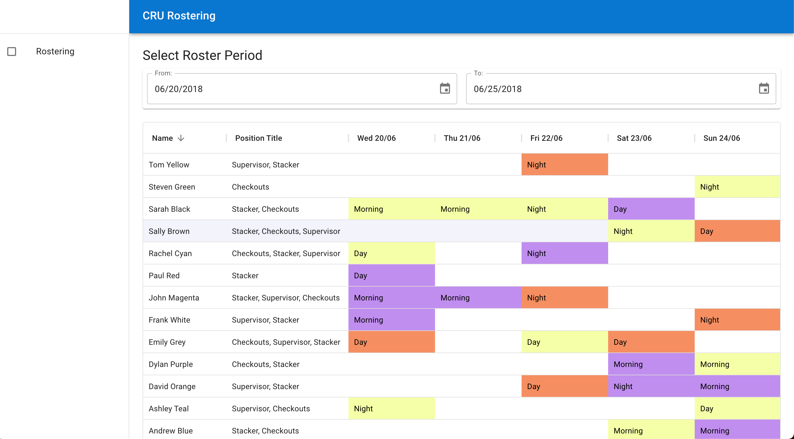
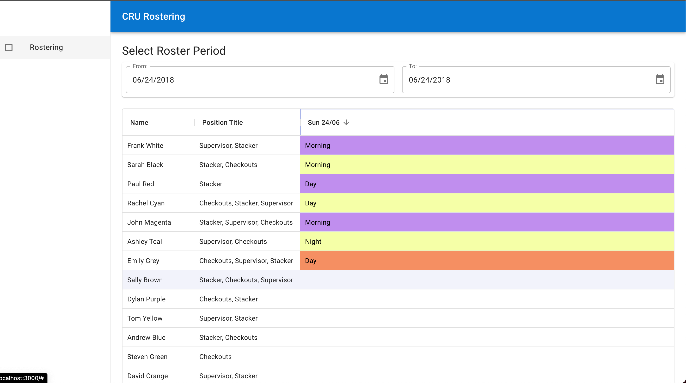
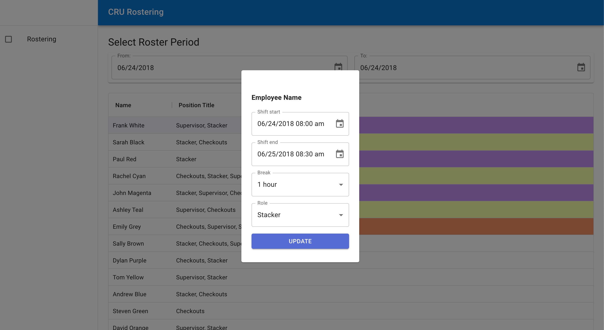

# Notes, choices & assumptions

- I opted to use material design to save some time on creating designs and not overcomplicating this matter as I determined it was more about demonstrating quality, structure, and logic implementation rather than the simple component design.

- I wasn't sure of the best way to display data as I've never worked with or seen a rostering app or been on a roster before. I decided to simply reference the screenshot for CRU's product and have a go at infering functinonality from that

-The user can select between 1 - n days to display, any amount over 7 days e.g one week will not display well, this is a limiation i chose not to address for this test

- The start / end time update is not the most user-friendly but more powerful as it allows changing time and day for the shifts.

- The Material UI datagrid can be more customised to allow proper sorting with logic, I opted not to invest time in this for the technical test

- The design was done on a 13" macbook pro and I opted not to design responsively for mobile and tablet screen-sizes as this would be quite a bit more time consuming

- I have only implemented basic update functionality for the start / end times as per the specifications, this only updates locally in the store as there is no API. Break and role does not update but is provisioned.

- The config and shifts are in local store, not persisted. In reality this would update an API endpoint

- The logic for employees not getting direct back-to-back days would be left up to the organiser manually for now. This should be clear

- I built a bit of surrounding ecosystem for the repo, added some basic tests but it's not comprehensive by any means

- Opted not to do the following as I felt the repo was enough to demonstrate what was being asked
- TODO: Handling for overlapping shifts
- TODO: Tabular easy-edit view (handle-able by the modal popup)

##





## Getting Started

First, run the development server:

```bash
npm run dev
# or
yarn dev
```

Open [http://localhost:3000](http://localhost:3000) with your browser to see the result.
